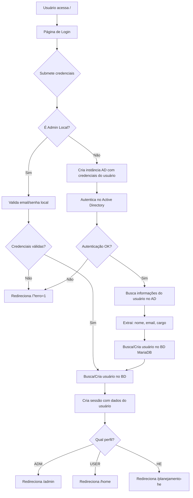
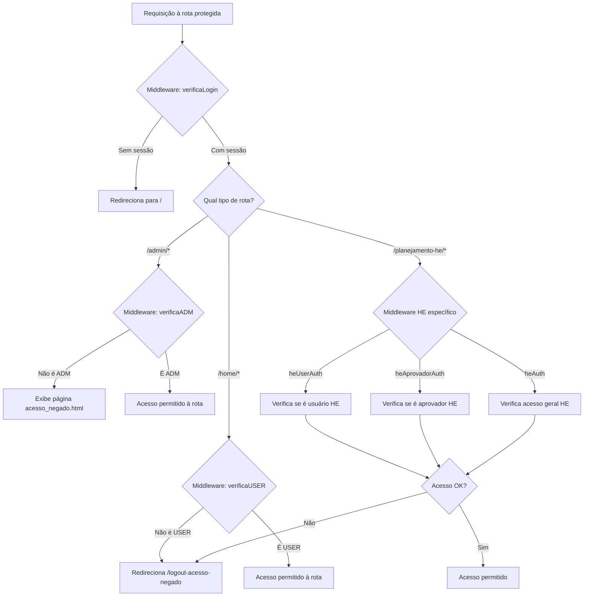
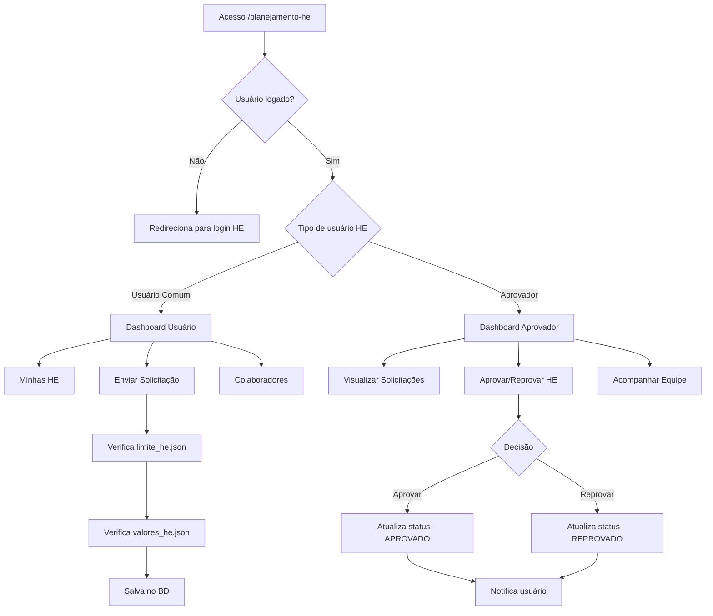
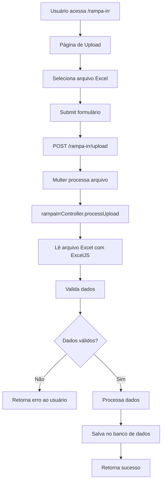
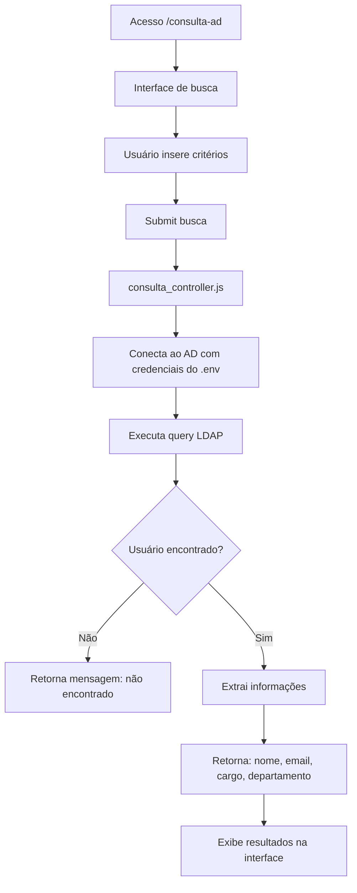
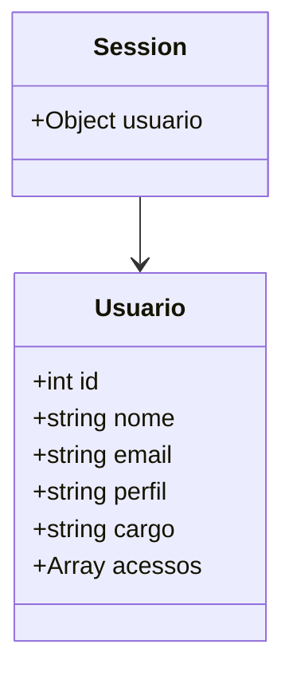
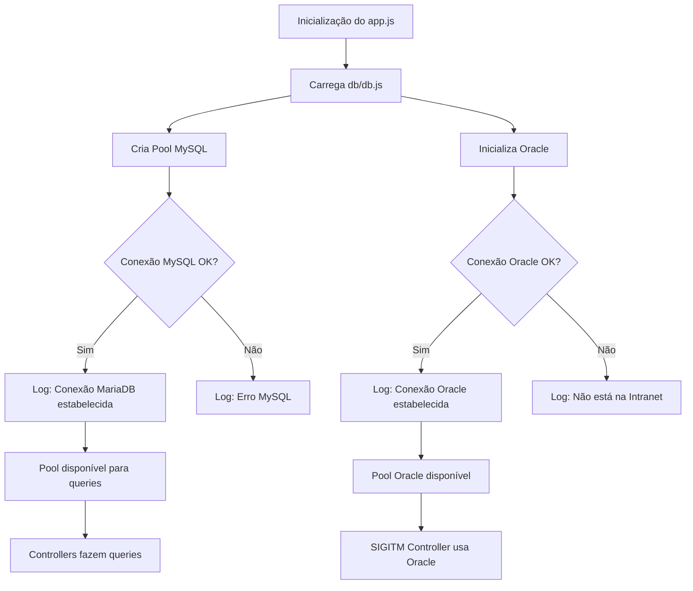

# Fluxograma do Sistema THANOS (TCore v2.0.5)

## 1. Fluxo de Autenticação



## 2. Fluxo de Acesso às Rotas Protegidas



## 3. Arquitetura Geral do Sistema

```mermaid
flowchart TB
    subgraph Frontend
        A[Views HTML]
        B[Public CSS/JS]
        C[Views HE]
    end

    subgraph "Express App (app.js)"
        D[Servidor Express :3000]
        E[Session Middleware]
        F[Body Parser]
        G[Static Files]
    end

    subgraph "Rotas Públicas"
        H[/ - Login]
        I[/painel_reparos]
        J[/rampa-irr]
    end

    subgraph "Rotas Protegidas"
        K[/home - USER]
        L[/admin - ADM]
        M[/planejamento-he - HE]
        N[/consulta-ad]
    end

    subgraph Middlewares
        O[verificaLogin]
        P[verificaADM]
        Q[verificaUSER]
        R[heAuth]
        S[heAprovadorAuth]
        T[heUserAuth]
    end

    subgraph Controllers
        U[batimento_b2b.js]
        V[rampa_irr_controller.js]
        W[sigitm.js]
        X[uploadPosbd.js]
        Y[planejamentoHEController.js]
    end

    subgraph "Banco de Dados"
        Z[(MariaDB - users_thanos)]
        AA[(Oracle - SIGITM)]
    end

    subgraph "Serviços Externos"
        AB[Active Directory LDAP]
    end

    A --> D
    B --> D
    C --> D
    D --> E
    E --> F
    F --> G
    G --> H
    G --> I
    G --> J

    H --> O
    I --> O
    J --> O

    O --> K
    O --> L
    O --> M
    O --> N

    K --> Q
    L --> P
    M --> R
    M --> S
    M --> T
    N --> O

    K --> U
    K --> V
    L --> W
    L --> X
    M --> Y

    U --> Z
    V --> Z
    W --> AA
    X --> Z
    Y --> Z

    O --> AB
    P --> AB
```

## 4. Fluxo do Módulo de Planejamento HE



## 5. Fluxo de Upload e Processamento (Rampa IRR)



## 6. Fluxo de Consulta AD



## 7. Estrutura de Dados - Sessão do Usuário



## 8. Fluxo de Logout

```mermaid
flowchart TD
    A{Tipo de logout} --> B[/auth/logout]
    A --> C[/auth/logout-he]
    A --> D[/logout-acesso-negado]

    B --> E[req.session.destroy]
    C --> E
    D --> E

    E --> F{Logout bem-sucedido?}
    F -->|Sim| G{Qual tipo?}
    F -->|Não| H[Log de erro]

    G -->|Normal| I[Redireciona para /]
    G -->|HE| J[Redireciona /planejamento-he]
    G -->|Acesso Negado| K[Exibe acesso_negado.html]

    H --> I
```

## 9. Estrutura de Módulos

```mermaid
graph TD
    A[app.js - Servidor Principal] --> B[Routes]
    A --> C[Controllers]
    A --> D[Middlewares]
    A --> E[Views]
    A --> F[DB]

    B --> B1[auth.js - Autenticação]
    B --> B2[protected.js - Rotas USER]
    B --> B3[admin.js - Rotas ADM]
    B --> B4[planejamentoHERoutes.js]
    B --> B5[consulta_route.js]

    C --> C1[batimento_b2b.js]
    C --> C2[rampa_irr_controller.js]
    C --> C3[sigitm.js]
    C --> C4[uploadPosbd.js]
    C --> C5[planejamentoHEController.js]

    D --> D1[autenticacao.js]
    D --> D2[heAuth.js]
    D --> D3[heAprovadorAuth.js]
    D --> D4[heUserAuth.js]

    F --> F1[db.js - MySQL Pool]
    F --> F2[db.js - Oracle Pool]

    E --> E1[login.html]
    E --> E2[index.html]
    E --> E3[admin_panel.html]
    E --> E4[planejamento_he.html]
```



## 10. Fluxo de Conexão com Bancos de Dados



---

## Legenda de Perfis

- **ADM**: Administrador com acesso total
- **USER**: Usuário comum com acesso limitado
- **HE User**: Usuário do módulo de Horas Extras
- **HE Aprovador**: Aprovador de Horas Extras

## Portas e Endpoints Principais

- **Porta**: 3000
- **Host**: 10.59.112.107
- **Públicas**: /, /login, /painel_reparos, /rampa-irr
- **Protegidas**: /home, /admin, /planejamento-he, /consulta-ad
